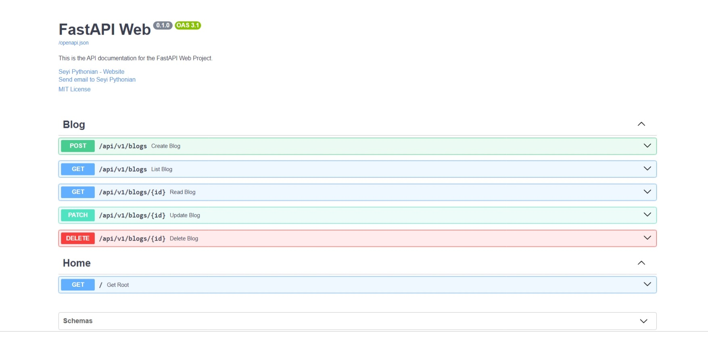

# FastAPI Project

Welcome to the FastAPI project! Follow these instructions to set up the project on your local machine and get everything running smoothly.

## Project Overview

This FastAPI project is a learning tool and development playground where I am building various app modules to deepen my understanding of FastAPI. The project starts with a blog feature, and I plan to expand it with additional apps as I continue to learn and explore FastAPI's capabilities.



## Prerequisites

Before you begin, the project assumes the following:

- A Linux environment, or WSL (if using Windows)
- Python 3.10 or later installed.
- PostgreSQL installed.

A Makefile has been provided for easy project setup.

## Setup Instructions

- **Clone the Repository**

   ```bash
   git clone https://github.com/Pythonian/fastapi_web.git
   ```

- Change into the cloned repository

   ```bash
   cd fastapi_web
   ```

- **Create a Virtual Environment**

   ```bash
   make venv
   ```

   Activate the virtual environment with the command:

   ```bash
   source .venv/bin/activate
   ```

   *Ensure the virtual environment is activated before running any further commands.*

- **Install Dependencies**

   ```bash
   make install
   ```

   This command will copy an `.env` file into your directory. Open it and update the values before you proceed.

- **Make Migrations**

   Run the alembic migration to create the Tables in your database.

   ```bash
   make migrate
   ```

- **Run Checks**

   Ensure that everything is set up correctly:

   ```bash
   make check
   ```

- **Run the Development Server**

   ```bash
   make run
   ```

   The API documentation is available at `http://127.0.0.1:8000/docs/`.

   Or if you prefer using Redocly, at `http://127.0.0.1:8000/redoc`

- **Cleaning Up**

   To clean up the project directory:

   ```bash
   make clean
   ```

   You can run the command `make` to see all available commands.

## Credits

- [HNG Boilerplate](https://github.com/hngprojects/hng_boilerplate_python_fastapi_web)
- [FastAPI Tutorial](https://www.youtube.com/playlist?list=PLEt8Tae2spYnHy378vMlPH--87cfeh33P)
- [API Best Practices](https://github.com/saifaustcse/api-best-practices)
